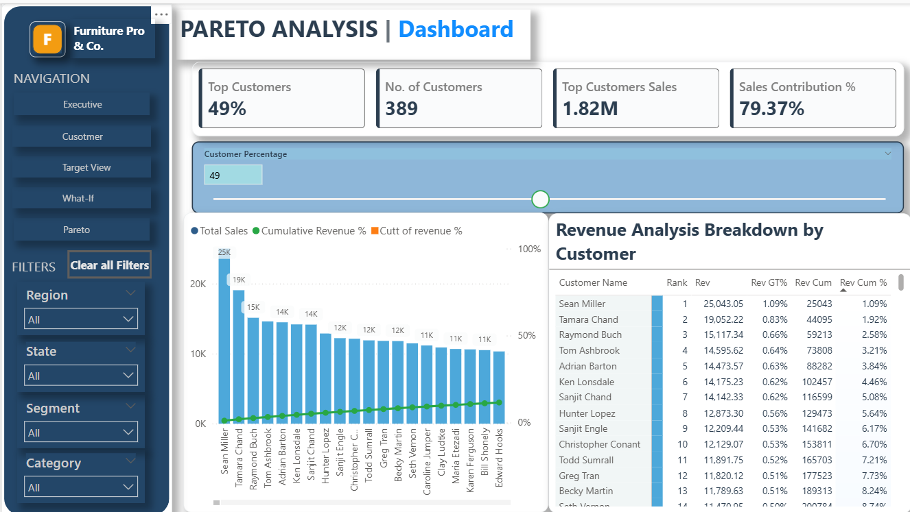

# 📊 FurniturePro & Co. – Power BI Sales & Customer Intelligence Dashboard

A complete Power BI case study built for **FurniturePro & Co.**, a fictional retail chain, focused on delivering deep insights across sales performance, customer behavior, profitability, and marketing targeting. This project highlights strong analytical storytelling using Power BI's full stack—data modeling, Power Query, advanced DAX, and dashboard design.

---

## 🚀 Project Highlights

- ✅ 5-tab interactive Power BI dashboard (Executive, Customer, Target, What-If, Pareto)
- 📈 Dynamic KPIs with YoY & MoM trend analysis
- 🔍 RFM segmentation and customer retention logic
- 🎯 Target vs Actual comparison with conditional formatting
- 🧪 What-If scenario using user-defined discounts and predicted profit
- 📊 Pareto analysis – top customers and their sales contribution
- 🧠 Bonus: Scoring logic for marketing action planning

---

## 🧠 Business Objectives

- Understand regional and segment-wise sales trends
- Compare current vs previous year performance
- Identify customer segments using RFM logic (Recency, Frequency, Monetary)
- Highlight top-performing salespersons by state & segment
- Help marketing teams identify high-value and at-risk customers

---

## 🖼️ Dashboard Screenshots

### 1. Executive Summary  


### 2. Customer Analysis  


### 3. Target Tracking  


### 4. What-If Analysis  


### 5. Pareto Analysis  


---

## 💡 Top 5 Most Complex & Important DAX Measures

### 🏆 **1. Customer Retention Rate with Multi-Year Logic**

```dax
Customer Retention Rate = 
VAR _CurrentYear = SELECTEDVALUE('Date Table'[Year])
VAR _PreviousYear = _CurrentYear - 1

-- Customers in Previous Year
VAR CustomersPrev = 
    CALCULATETABLE(
        VALUES(Orders[Customer ID]),
        FILTER(ALL('Date Table'), 'Date Table'[Year] = _PreviousYear)
    )

-- Customers in Current Year
VAR CustomersCurr = 
    CALCULATETABLE(
        VALUES(Orders[Customer ID]),
        FILTER(ALL('Date Table'), 'Date Table'[Year] = _CurrentYear)
    )

-- Retained Customers: Present in both years
VAR Retained = COUNTROWS(INTERSECT(CustomersPrev, CustomersCurr))
VAR TotalPrev = COUNTROWS(CustomersPrev)

RETURN DIVIDE(Retained, TotalPrev)
```

🔹 **Most Complex:** Uses INTERSECT, CALCULATETABLE, and cross-year customer comparison logic.

---

### 🎯 **2. Dynamic RFM Customer Segmentation**

```dax
RFM_Monetary_Score = 
VAR CustomerMonetary = [Customer Monetary]
VAR Rank_Monetary = RANKX(ALL(Orders[Customer ID]), [Customer Monetary], , DESC, DENSE)
VAR TotalCustomers = CALCULATE(DISTINCTCOUNT(Orders[Customer ID]), ALL(Orders))
VAR Percentile = Rank_Monetary / TotalCustomers
RETURN
    SWITCH(TRUE(),
        Percentile <= 0.2, 5,
        Percentile <= 0.4, 4,
        Percentile <= 0.6, 3,
        Percentile <= 0.8, 2,
        1
    )

Customer Segment = 
VAR R = [RFM Recency Score]
VAR F = [RFM Frequency Score] 
VAR M = [RFM_Monetary_Score]
RETURN
    SWITCH(TRUE(),
        R = 5 && F = 5, "Champions",
        R >= 4 && F >= 4, "Loyal Customers",
        R >= 4 && F <= 2, "New Customers",
        R <= 2 && F >= 4, "Can't Lose Them",
        R <= 2 && F = 3, "At Risk",
        "Exploring"
    )
```

🔹 **Advanced:** Multi-dimensional scoring with percentile calculations and 12+ customer segments.

---

### 🔮 **3. What-If Analysis: Multi-Segment Discount Impact**

```dax
Discount Impact = 
VAR ConsumerSales = CALCULATE([Total Sales], Orders[Segment] = "Consumer")
VAR CorporateSales = CALCULATE([Total Sales], Orders[Segment] = "Corporate")
VAR HomeOfficeSales = CALCULATE([Total Sales], Orders[Segment] = "Home Office")

VAR ConsumerImpact = ConsumerSales * ('Consumer Discount'[Consumer Discount Value] / 100)
VAR CorporateImpact = CorporateSales * ('Corporate Discount'[Corporate Discount Value] / 100)
VAR HomeOfficeImpact = HomeOfficeSales * ('Home Office Discount'[Home Office Discount Value] / 100)

RETURN ConsumerImpact + CorporateImpact + HomeOfficeImpact

Predicted Profit = 
VAR MarginLoss = [Discount Impact]
VAR VolumeGain = [Total Sales] * ([Volume Increase %] / 100) * 0.3
RETURN [Total Profit] - MarginLoss + VolumeGain
```

🔹 **Business Intelligence:** Multi-parameter scenario modeling with volume elasticity predictions.

---

### 📊 **4. Advanced Pareto Analysis with Dynamic Threshold**

```dax
Cut-off Customer = 
VAR ParoValue = CALCULATE([Sales Contribution %], REMOVEFILTERS(Customer[Customer Name]))
VAR SummaryTable =
    ADDCOLUMNS(
        SUMMARIZE(ALLSELECTED(Customer[Customer Name]), Customer[Customer Name]),
        "Sales", CALCULATE(SUM(Customer[total sales])),
        "Rank", [Rank],
        "CumulativeSalesPercentage", [Cumulative Revenue %],
        "Difference", ABS([Cumulative Revenue %] - ParoValue)
    )
RETURN
    MAXX(TOPN(1, SummaryTable, [Difference], ASC), Customer[Customer Name])

Pareto Rule Status = 
VAR Contribution = [Sales Contribution %]
VAR CustomerPct = SELECTEDVALUE('Revenue Percentage'[Customer Percentage])
RETURN
    SWITCH(TRUE(),
        CustomerPct <= .20 && Contribution >= .80, "ACHIEVED",
        CustomerPct <= .25 && Contribution >= .75, "NEAR",
        "DISTANT"
    )
```

🔹 **Statistical Analysis:** Dynamic 80/20 rule validation with cumulative calculations.

---

### 🎨 **5. Dynamic Performance Classification & Formatting**

```dax
Performance_Label = 
SWITCH(TRUE(),
    [Growth Pct] > 0.15, "Excellent",
    [Growth Pct] > 0.05, "Good", 
    [Growth Pct] >= -0.05, "Stable",
    [Growth Pct] >= -0.15, "Declining",
    "Poor"
)

CF Growth Colors Sales = 
VAR _Change = DIVIDE([Total Sales(Net)] - [Net Sales Last Year], [Net Sales Last Year])
RETURN
    IF(ISBLANK(_Change), BLANK(),
        SWITCH(TRUE(),
            _Change >= 0.15, "#d4edda",    -- High Growth (Light Green)
            _Change >= 0.05, "#e8f5e8",    -- Good Growth 
            _Change >= -0.05, "#f8f9fa",   -- Stable (Light Gray)
            _Change >= -0.15, "#fff3cd",   -- Decline (Light Yellow)
            "#f8d7da"                      -- Poor Performance (Light Red)
        )
    )
```

🔹 **Visual Intelligence:** Complete conditional formatting system with performance indicators and color coding.